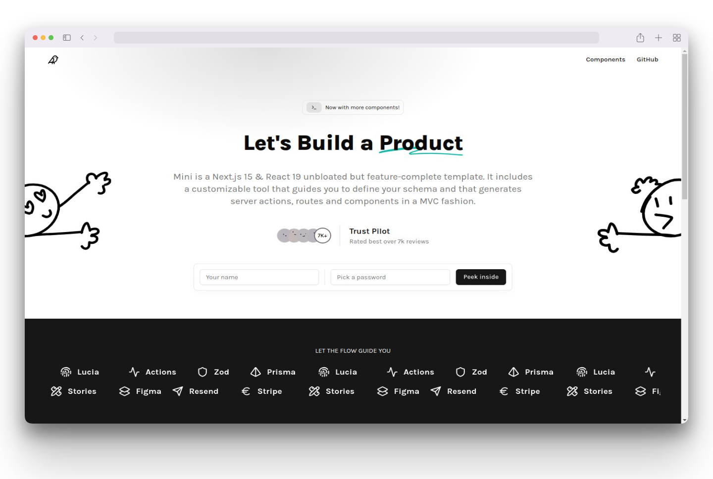

# Mini

Mini is a template & tool akin to Kirimase aimed at providing customization options for the UI instead of the backend-for-frontend, which could result in a paradox of choice where you have more engagement for the project but less actual builders.

The idea is that you use the CLI to swap components and then code in an MVC fashion. This way, not only do you "code at the speed of light", but you also have a minimal-viable-product to show off to your clients in no time, customized of course.

[Demo](https://mini-eight-sigma.vercel.app), [Components](https://mini-storybook-liard.vercel.app/).

## 👷 WIP

This project is currently a WIP. All features are being actively developed, please come back in a few days.

## ✅ Key Features

- **Greefield Stack:**

  - Built with Next.js 15 & React 19 (Release Candidates)
  - All dependencies to the latest version
  - Server actions with optimistic UI for improved user experience

- **Design-Driven Development:**

  - Figma file included, themeable with variants
  - Includes Storybook too

- **Component Library:**

  - Custom shadcn-ui components
  - Animated with Framer Motion only

- **CLI Tool:**
  - MVC code-generation for rapid development
  - Customization options to fit your project's needs

## 🛠️ Getting Started

`pnpm install && pnpm dev`, you know the drill.

## 📚 Documentation

`pnpm mini`
